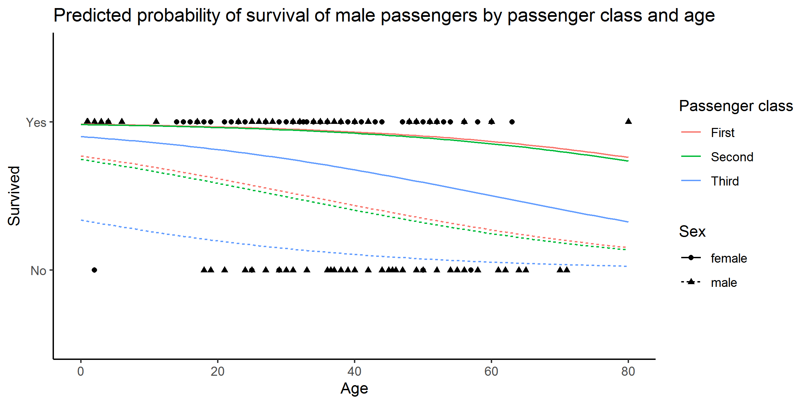

# Exercise on Git/GitHub

In this exercise, I added 3 files on this repo:
* **[titanic_codebook.txt](titanic_codebook.txt)** - which contains some information on titanic
* **[titanic.csv](titanic.csv)** - which contains the data set of the passengers on titanic
* **[titanic.R](titanic.R)** - which contains the analysis of the data set of the passengers on titanic written in R

In **[titanic.R](titanic.R)**, I added an extra command, `ggsave()`, which saves the last plot displayed.

Here is the plot that resulted from the added command `ggsave()`:

